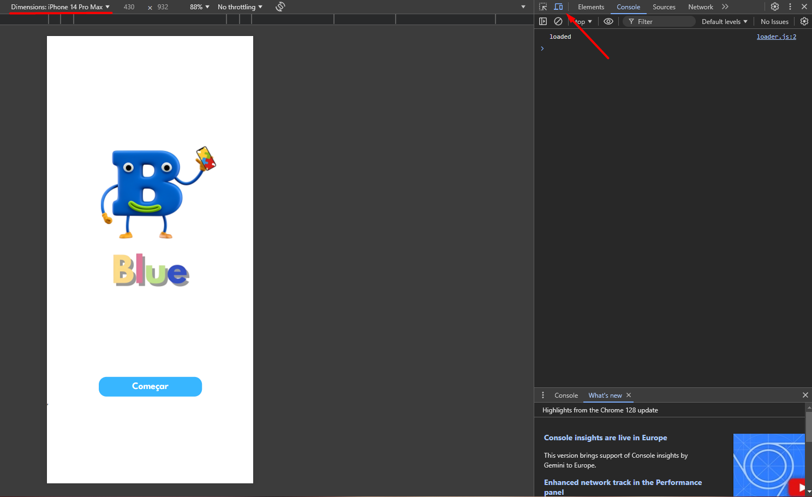

### Dependencies

To clone and start the project locally, you first need to install:

- [VS Code](https://code.visualstudio.com/)
- [GIT](https://git-scm.com/book/pt-pt/v2/Come%C3%A7ando-Instalar-o-Git)
- [Node.js](https://nodejs.org/pt)

### Cloning the repository

To clone the repository, open your terminal (Git Bash or PowerShell) in the desired folder and run the following command:

```
git clone https://github.com/your-username/your-repository.git
```

Make sure to replace `your-username` with your GitHub username and `your-repository` with the name of your repository.


### Running locally

In the same location as the previous command, access the cloned project folder:

```
cd .\ba-blue\
```

Open the project in VS Code to view all files:

```
code .
```

Open the project in VS Code to view all files and open the integrated terminal:


Install project dependencies

```
npm install
```

Check which branch you are on

```
git branch
```


If you are in Main, change it to develop

```
git switch develop
```

Use the command to run the app in the development mode:

```
npm start
```

Open [http://localhost:3000](http://localhost:3000) to view it in your browser.

To view on a mobile device's dimensions, inspect the page in the browser and select the device option:




